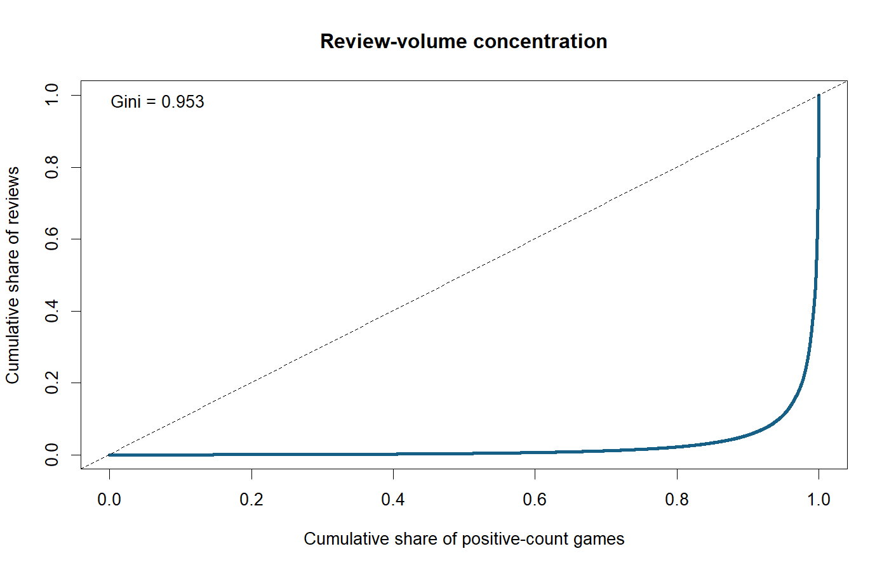
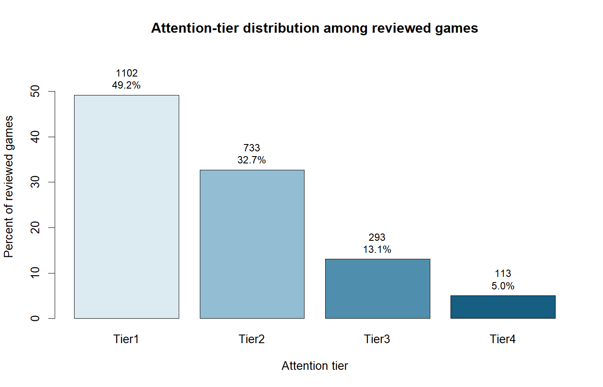
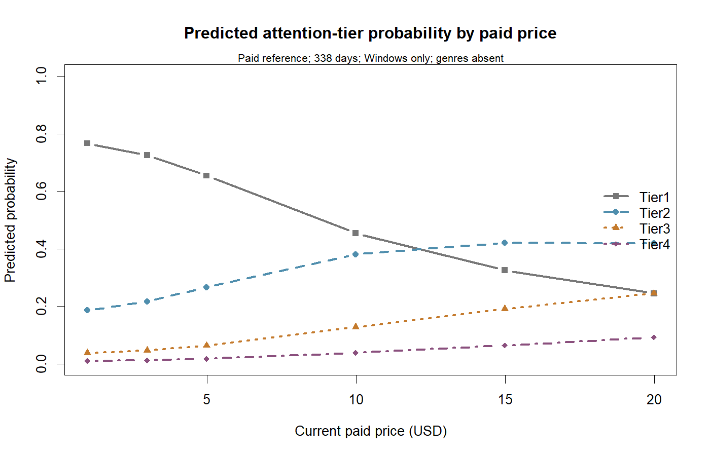
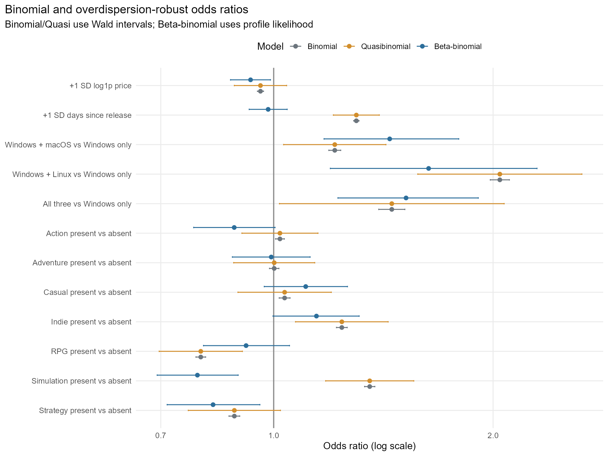
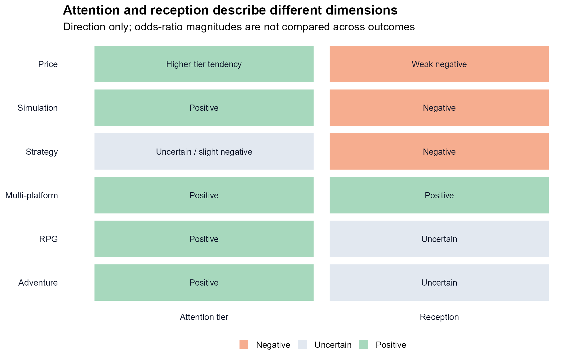
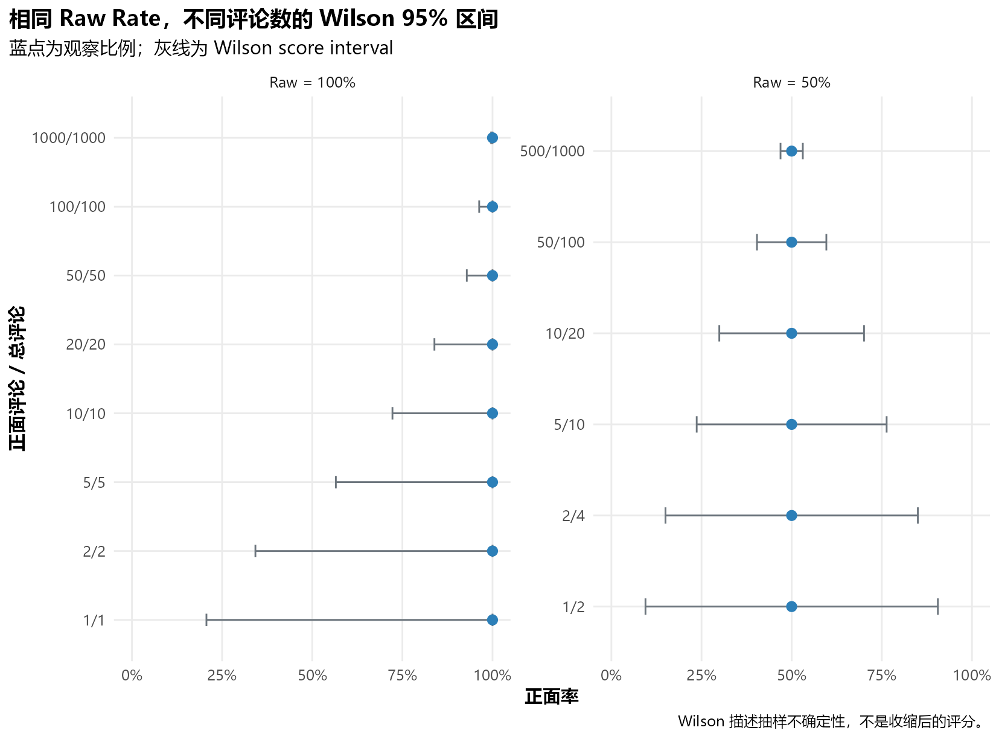
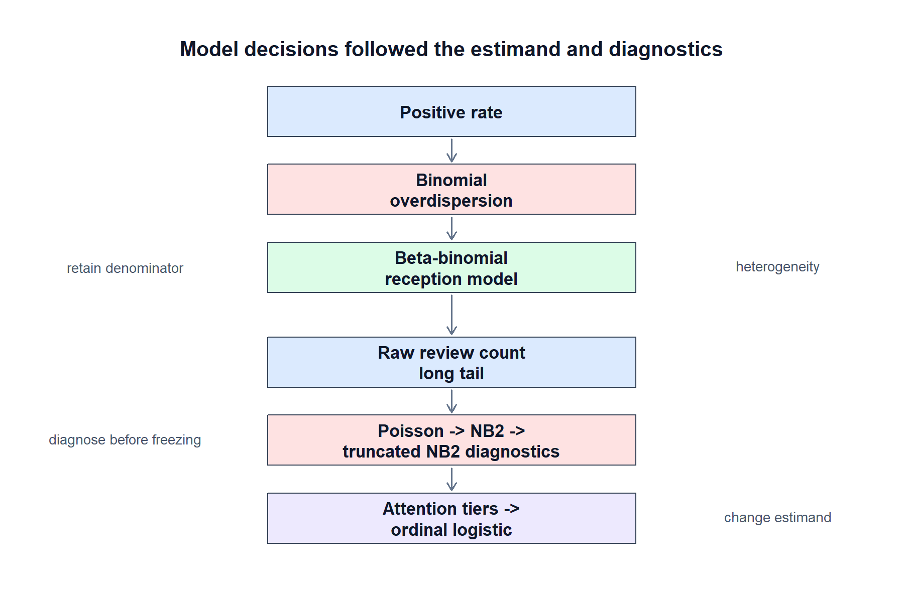

# Steam 新游市场与玩家评论分析

基于 2025 年 7–12 月新发行的 3,000 款 Steam 游戏，分析新游在**市场关注、评论规模、玩家口碑和评分可信度**上的差异，并尝试回答一个更接近实际发行的问题：

> 一款游戏表现不佳，到底是因为没有获得足够关注，还是已经获得关注但没有得到玩家认可？

项目从数据采集开始独立完成。Python 用于采集和清洗数据，MySQL 保存分析数据，R 完成统计分析和可视化，最终通过 Quarto 生成完整分析报告。

**数据规模：** 3,000 款游戏 · 2,598 款付费游戏 · 402 款免费游戏 · 2,241 款至少获得一条评论

---

[在线查看完整分析报告](https://mrzephyrer.github.io/steam-game-analysis/)

[](https://github.com/MRZEPHYRER/steam-game-analysis/actions/workflows/python-tests.yml)

## 项目背景

最初的分析目标是研究 Steam 新游戏的评分和评论表现。

但在数据探索阶段，很快出现了两个问题。

首先，大量游戏根本没有形成足够的玩家反馈。3,000 款游戏中有 **759 款没有任何评论，占 25.3%**。

其次，即使只看已经获得评论的游戏，评论量也极度集中。评论量最高的 **1% 游戏贡献了约 65.4% 的全部评论，Top 5% 接近 89%**，评论量 Gini 系数达到 **0.953**。

<p align="center">
  
</p>

*图：评论关注度高度集中于少数头部游戏。*

因此，仅仅研究“什么游戏好评率更高”并不足以描述一款新游戏的市场表现。

最终把问题拆成了三个阶段：

| 阶段 | 主要问题 | 分析方式 |
| --- | --- | --- |
| 评论进入 | 游戏能否获得第一批评论？ | Logistic 回归 |
| 关注强度 | 已经获得评论后，能否进入更高关注层级？ | 有序 Logistic 回归 |
| 玩家口碑 | 获得玩家反馈以后，正面评价倾向如何？ | Beta-binomial 回归 |

另外增加了 Wilson 区间和经验贝叶斯调整，用来判断一个游戏当前的好评率到底有多可靠。

这种拆分的目的并不是增加模型数量，而是避免把“有没有被看到”和“被看到以后喜不喜欢”混成同一个问题。

---

## 主要发现

### Steam 新游首先面临的是关注度问题，而不仅是评分问题

样本中四分之一的游戏没有任何评论；即使已经获得评论，接近一半也只有 1–9 条。

评论量高度向少数头部游戏集中，因此平均评论数并不能很好地描述一个普通新游戏所处的市场环境。

这也是为什么后续没有继续直接预测原始评论数。Poisson、Negative Binomial 等计数模型都进行了尝试，但结果对少数爆款游戏过于敏感。最终改为将评论量划分为：

- 1–9
- 10–99
- 100–999
- 1,000+

四个有序关注等级。

<p align="center">
  
</p>

*图：有评论游戏在四个关注等级中的分布。*

这个处理牺牲了一部分精确计数信息，但换来了更加稳定、也更容易解释的市场层级。

---

### 哪些特征与更高的关注度有关

在控制上市时间、价格、平台和主要游戏类型以后，多平台支持以及部分类型与更高的评论关注等级存在较稳定的关联。

其中比较明显的结果包括：

| 特征 | 与更高关注等级的关系 |
| --- | --- |
| Windows + macOS + Linux | OR ≈ **1.79** |
| Simulation | OR ≈ **1.44** |
| RPG | OR ≈ **1.31** |
| Adventure | OR ≈ **1.30** |

例如三平台游戏进入更高关注等级的 odds 约为 Windows-only 游戏的 1.79 倍。

这里并不能直接得出“增加平台支持就能提高热度”的因果结论。更合理的解释是，多平台支持往往也伴随着更高的项目完成度、开发资源和发行能力，因此它可能同时反映项目本身的成熟程度。

价格与关注度之间也存在明显关系，但不是简单的线性关系。

在样本比较集中的价格区间内，极低价游戏进入较高关注层级的概率相对较低；价格上升到十几美元以后，变化逐渐趋于平台。

因此，价格在当前项目中更适合被理解为**产品规模和市场定位的信号**，而不是一个可以简单操作的“热度按钮”。

<p align="center">
  
</p>

*图：不同价格下四个关注等级的预测概率。*

---

### 获得关注和获得好口碑并不是同一件事

玩家口碑是项目中另一个独立的问题。

这里没有直接把好评率作为普通连续变量处理，因为：

`1 / 1 = 100%`

和

`1000 / 1000 = 100%`

虽然显示出来都是 100%，但两者包含的信息量完全不同。

普通 Binomial 模型在实际数据中出现了非常明显的过度离散，Pearson dispersion 约为 **73.5**，说明不同游戏之间还存在大量没有被基础商店属性解释的异质性。因此最终采用 Beta-binomial 模型作为玩家口碑的主要模型。

<p align="center">
  
</p>

*图：过度离散稳健的玩家口碑关联估计。*

其中最值得注意的是 Simulation。

在关注度模型中：

**Simulation → 更容易进入较高关注等级，OR ≈ 1.44**

但在玩家口碑模型中：

**Simulation → 正面评价倾向更低，OR ≈ 0.79**

也就是说，在这批 Steam 新游中，模拟类游戏更容易形成较高的评论关注度，但获得关注之后，玩家评价反而相对更严格。

Strategy 也呈现类似的口碑负向关系，OR 约为 **0.83**。

价格与玩家口碑之间则存在一个较弱但相对稳定的负向关系，OR 约为 **0.93**。这个结果说明高价游戏的正面评价倾向略低，但幅度并不大，而且不能直接解释为价格上涨导致差评。

这一组结果表明，**关注度和玩家口碑应该作为两个独立指标观察。**

一个游戏可以非常容易吸引玩家注意，却未必能够把这些关注转化成满意度；反过来，也可能存在口碑不错但长期没有得到足够曝光的游戏。

<p align="center">
  
</p>

*图：关注度与玩家口碑是两个不同的分析维度。*

---

## 好评率还需要考虑样本量

Steam 页面上的原始好评率还有另外一个问题：它没有直接体现这个比例背后的样本量。

因此项目中又加入了两种评分可靠性指标：

- **Wilson 区间**：判断当前好评率在统计意义上的可信下界；
- **经验贝叶斯调整**：对低评论量下的极端评分进行适度收缩。

<p align="center">
  
</p>

*图：相同的 100% raw rating 在不同评论分母下具有不同的不确定性。*

它们共同解决的是一个实际问题：

> 少量评论形成的 100% 好评，不应该和几千条评论形成的高评分具有同样的判断权重。

评论越少，调整越明显；随着评论数增加，调整快速减弱。评论量达到较高水平后，经验贝叶斯调整已经非常小。

因此，如果把这套分析用于竞品筛选或项目选品会更倾向于同时观察：

**评论规模 + 玩家口碑 + 评分可靠性**

而不是只按照 Steam 原始好评率排序。

---

## 从分析结果到实际业务

如果把关注度和玩家口碑放在一起，可以得到一个比较直观的项目诊断框架。

|  | 口碑较好 | 口碑较弱 |
| --- | --- | --- |
| **关注度高** | 已经形成市场验证，可以考虑继续扩大投入 | 流量已经存在，应优先解决产品体验问题 |
| **关注度低** | 产品可能被低估，可以进一步测试曝光和发行策略 | 应谨慎继续增加投入 |

它不能直接替代企业内部的投放系统，但可以帮助判断**下一步资源应该投到市场端还是产品端**。

例如，一款游戏关注度较低，但已经获得的玩家反馈很好，那么它的问题可能更多出现在市场触达。这种情况下，更值得测试商店素材、KOL 合作、促销和其他曝光方式。

反过来，如果一款游戏已经获得大量关注，但玩家口碑明显偏弱，那么继续增加流量未必是最优选择。此时更应该优先检查：

- 性能和 BUG
- 新手引导
- UI / UX
- 内容量
- 核心玩法体验
- 宣传内容与实际产品之间的预期差

Simulation 的结果就是一个比较典型的例子：数据并不支持“模拟类游戏缺少吸引力”，反而说明这一类型更容易获得关注；真正值得关注的是它们在吸引玩家以后，如何把关注转化成满意度。

---

## 商业价值和目前的边界

当前项目更准确的定位是一套：

**Steam 新游市场分析与发行决策支持原型。**

它可以用于辅助判断：

- 游戏是否存在明显的冷启动问题；
- 当前关注度处于什么层级；
- 玩家口碑是否与市场关注匹配；
- 一个高评分是否已经具有足够的样本支撑；
- 同类游戏在价格、平台和品类上的市场表现如何。

它目前还不能直接计算广告 ROI、ROAS 或预测真实收入，因为公开 Steam 数据中没有完整的广告曝光、商店访问、愿望单、购买、退款、营销成本和实际销售收入。

如果接入企业侧这些数据，现有框架可以继续扩展为更完整的发行漏斗：

```text
曝光 → 商店访问 → 购买 → 评论 → 关注度 → 玩家口碑 → 收入
```

届时才可以进一步研究渠道转化、预算分配和增量收入。

因此，当前分析的实际价值不是直接输出“哪个游戏一定赚钱”，而是**把一个模糊的“游戏表现不好”拆成几个可以分别判断的问题，从而减少错误投放和错误产品判断。**

---

## 方法选择

项目中的统计方法并不是一开始就固定好的，而是在模型诊断过程中逐步确定。

几个比较关键的调整包括：

- 普通 Binomial 在口碑数据中出现严重过度离散，因此改用 Beta-binomial；
- 原始评论数受少数头部游戏严重支配，因此放弃不稳定的计数模型，改为有序关注等级；
- 价格与获得评论概率存在明显非线性，因此使用自然样条而不是单一线性系数；
- 原始好评率无法反映样本量差异，因此加入 Wilson 区间和经验贝叶斯调整。

<p align="center">
  
</p>

*图：模型选择沿着 estimand 与诊断结果逐步确定。*

这里的原则比较简单：

**模型能够运行，不代表结果就值得解释。**

因此，项目中也保留了没有通过诊断的模型和相应结果，而不是只留下最终“成功”的部分。

---

## 数据与技术实现

研究样本来自 2025 年 7 月至 12 月新发行的 Steam 游戏。初始候选集超过 1 万款，按发行月份比例分层抽样后固定为 3,000 款。

主要技术栈：

| 工具 | 用途 |
| --- | --- |
| Python | 数据采集、清洗、ETL 和自动化 |
| MySQL | 分析数据库和 SQL 探索 |
| R | EDA、统计建模、诊断和可视化 |
| Quarto | 可复现分析报告 |
| Git / GitHub | 版本控制和项目管理 |

目前完整自动化测试为 **273 passed**，分析数据库在建模和报告阶段保持只读。

---

## 数据解释边界

为了避免对结果进行过度解释，项目中统一采用以下口径：

- `total_reviews` 是评论关注度的代理指标，**不是销量**；
- 当前价格是数据采集时的美国商店价格，**不是首发价格或实际成交价格**；
- 平台、类型和价格模型描述的是**条件关联**，不是因果效应；
- 项目没有营销投入、品牌影响力、开发预算等变量，因此存在无法完全控制的外部因素。

完整的模型诊断、敏感性分析、图表和技术结果可以查看：

[`reports/12_full_statistical_analysis.html`](reports/12_full_statistical_analysis.html)

---

**Summary：**

> 基于 3,000 款 Steam 新游，把游戏的市场表现拆分为“是否获得反馈、关注度能否扩大、玩家是否满意以及当前评分是否可信”几个阶段，并分别建立统计模型，希望用数据区分一款游戏究竟是缺少市场关注，还是已经获得关注但产品体验没有承接住这些流量。

## Contributors

本项目由两位作者共同完成：

- [MRZEPHYRER](https://github.com/MRZEPHYRER)
- [pandaalexlly](https://github.com/pandaalexlly)
