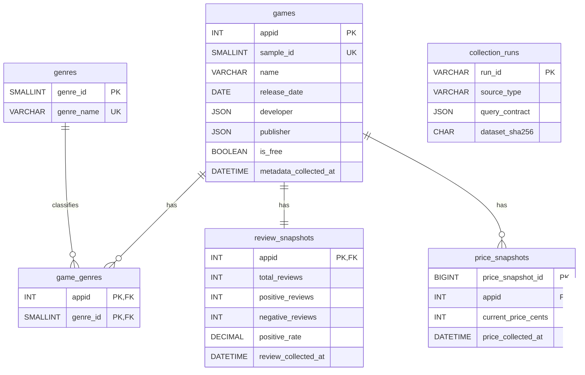

# MySQL analytical database schema

Step 3C materializes the frozen Step 3A metadata and Step 3B review snapshot in
MySQL 8. The database is `steam_game_analysis`, using `utf8mb4` and
`utf8mb4_0900_ai_ci`.



## Tables and grain

- `games`: one row per frozen sampled AppID. Developer and publisher arrays are
  preserved as JSON instead of being flattened into ambiguous strings.
- `genres`: one row per Steam genre identifier.
- `game_genres`: one row per AppID/genre pair.
- `review_snapshots`: one final Step 3B snapshot per AppID.
- `price_snapshots`: one observed price per AppID and collection timestamp. The
  surrogate key permits future snapshots; the AppID/timestamp pair is unique.
- `collection_runs`: provenance for the metadata and review datasets, including
  frozen SHA-256 values and the review query contract.

## Views

- `vw_game_analysis`: one analysis-ready row per game, combining the review
  snapshot and latest price snapshot.
- `vw_game_genres`: normalized game/genre names for joins and summaries.
- `vw_model_sample_20`: the frozen 844-game subset with at least 20 reviews.

## NULL semantics

- `publisher IS NULL` means Steam returned no publisher array. An empty JSON
  array, if ever present, remains distinct from SQL `NULL`.
- Price fields are `NULL` when no price overview existed. This is not equivalent
  to a free game; use `games.is_free` to identify free games.
- `positive_rate IS NULL` is required when `total_reviews = 0`. For reviewed
  games it must be in `[0, 1]`.
- `review_score` and `review_score_desc` may be `NULL` when Steam supplies no
  scored summary (notably zero-review rows).
- `is_early_access` remains `NULL` because the frozen source did not establish
  that attribute; it must not be interpreted as false.

## Build and credentials

Copy `.env.example` to `.env` and set the project-user credentials locally.
Never commit `.env`. An administrator may run `sql/00_admin_setup.sql` after
replacing its explicit placeholder. Then run:

```powershell
python scripts/build_mysql_database.py
Rscript R/00_db_smoke_test.R
```

The default Python command is non-destructive and re-audits a complete database.
It refuses a partial schema. Rebuilding requires the explicit
`--rebuild --yes` pair and only drops the six known Step 3C tables and three
known views.
